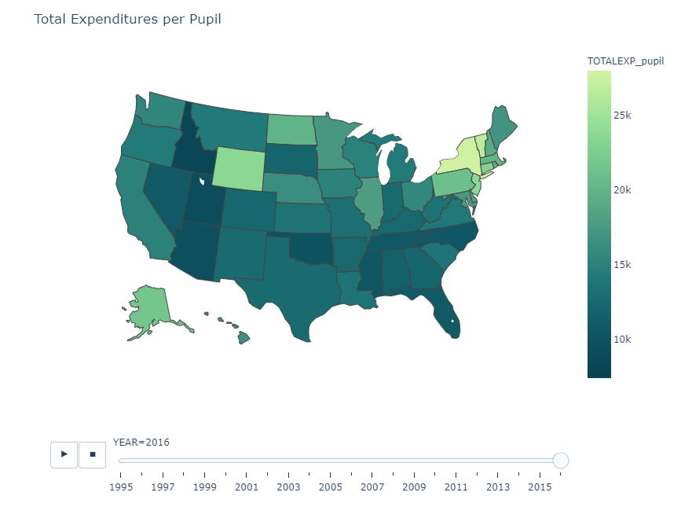

# High School Graduation Rates from US Educational Funding:
Guiding decision making with deep learning

**Contents:**
* [Background](#background)
* [Methods](#methods)
* [Results](#results)

## Background
Public education is one of the most important long term investments that government makes in society, with universally recognized effects on public health, security, and happiness. As such, it is a large consumer of taxpayer dollars, and if federal, state, and local funding is combined, is competitive with the national defense budget. However, outcomes are often unsatisfactory, entrenching pre-existing societal divisions and limiting the freedom of opportunity for communities without access to quality education. All this is despite one of the largest per student annual expenditures of any country in the world. As such, an evidence based evaluation of funding policy outcomes is of critical importance so that what money is available can be used to maximum effect. 

In this project, we attempt to use deep learning to gain insights into the relationship between school funding and educational outcomes, here measured by state-wide high school graduation rates. In particular, we will examine not only total funding amounts, but what revenue sources they draw from and how they are apportioned amongst instruction, support services, salaries, benefits, captial outlay etc. We will pay special attention to training our neural network to learn causal relationships, not merely correlations, by performing a time-series analysis in which the independent variables include not only current funding data, but historical funding policy and graduation rates. If we can obtain a model with good performance we can investigate not only the affect of overall funding increases, but how to most effectively use the funding at hand to obtain a desired outcome.

## Methods

We will use data from the National Center for Education Statistics (NCES) to establish causal relationships between budgetary factors and high school graduation rates. High school graduation rates are obtained from the NCHEMS Information Center for Higher Education Policymaking and Analysis as measured by the Adjusted Cohort Graduation Rate (ACGR), that is, the percentage of an entering 9th grade class that graduates four years later. One can 

 
 

These budgetary factors will include (per student) overall funding, as well as how it is distributed amongst teacher salaries and benefits, operation and maintenance, administration, instructional equipment, pupil services, and other factors. Other direct results of budgetary policy such as teacher/student ratio will be included as well. Societal outcomes we hope to investigate are high school graduation rate, college graduation rate, drug overdose rates, community median income, and community employment rates. Of course, these societal factors may just as easily influence education funding as funding may influence society, so we seek to establish causation by comparing change in budgetary policy to change in societal outcomes after a given time delay. If sufficient data and can be found, the strongest evidence would come from communities with similar initial conditions but with differing changes to budgetary policy.

## Results

## Usage

This project is best viewed in a notebook viewer, which can be accessed [here](./modeling-burden-of-hunger-in-malawi.ipynb). In this notebook, you will find a walk through of the work done and the respective code.
