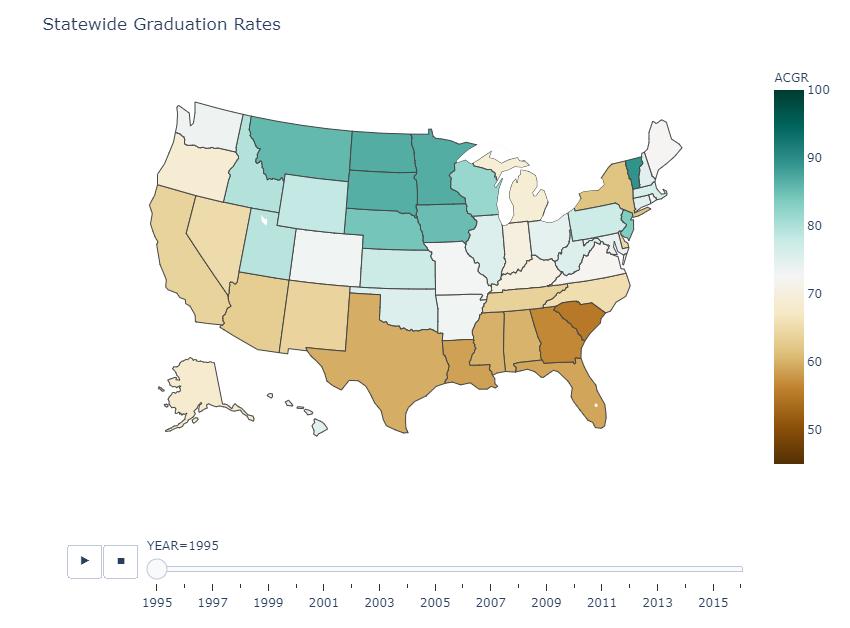
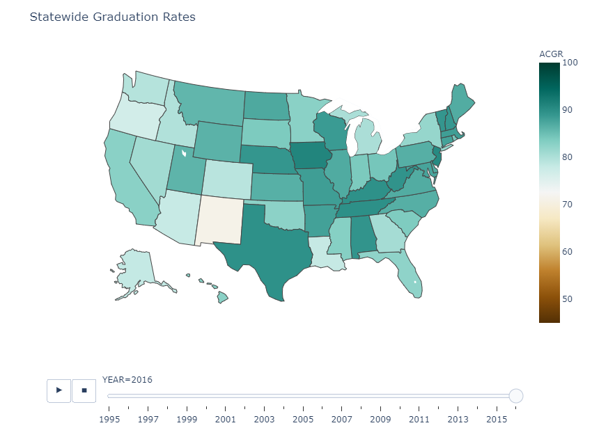
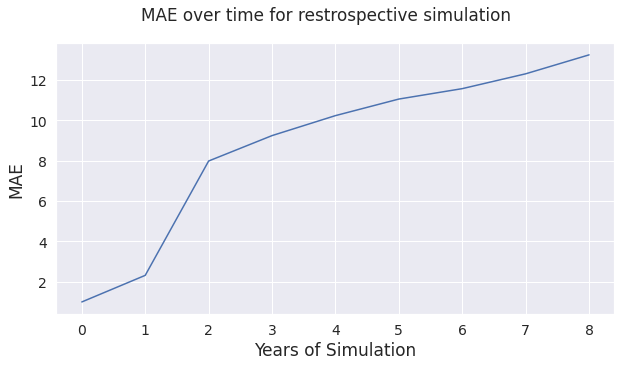

# High School Graduation Rates from US Educational Funding: Guiding decision making with deep learning

**Contents:**
* [Background](#background)
* [Methods](#methods)
* [Results](#results)

## Background
Public education is one of the most important long-term investments that government makes in society, with universally recognized effects on public health, security, and happiness. As such, it is a large consumer of taxpayer dollars, and if federal, state, and local funding is combined, is competitive with the national defense budget. However, outcomes are often unsatisfactory, entrenching pre-existing societal divisions and limiting the freedom of opportunity for communities without access to quality education. All this is despite one of the largest per student annual expenditures of any country in the world. As such, an evidence-based evaluation of funding policy outcomes is of critical importance so that what money is available can be used to maximum effect. 

In this project, we attempt to use deep learning to gain insights into the relationship between school funding and educational outcomes, here measured by state-wide high school graduation rates. In particular, we will examine not only total funding amounts, but what revenue sources they draw from and how they are apportioned amongst instruction, support services, salaries, benefits, capital outlay etc. We will pay special attention to training our neural network to learn causal relationships, not merely correlations, by performing a time-series analysis in which the independent variables include not only current funding data, but historical funding policy and graduation rates. If we can obtain a model with good performance, we can investigate not only the effect of overall funding increases, but how to most effectively use the funding at hand to obtain a desired outcome.

## Methods

We will use data from the National Center for Education Statistics (NCES) to establish causal relationships between budgetary factors and high school graduation rates. High school graduation rates are obtained from the NCHEMS Information Center for Higher Education Policymaking and Analysis as measured by the Adjusted Cohort Graduation Rate (ACGR), that is, the percentage of an entering 9th grade class that graduates four years later. We will study the change in the ACGR over the 22-year period from 1995 to 2016 when data is available.

 
 

The independent variables are budgetary factors which include (per student) overall funding, as well as how it is distributed amongst teacher salaries and benefits, operation and maintenance, administration, instructional equipment, pupil services, and other factors. This data as well as revenue sources (state, federal, property tax, title I, etc.) is obtained from the NCES for the years under consideration. Taken together, this data includes over 100 budgetary features collected over 22 years in more than 18,000 academic institutions in all 50 states.

 
 

Since we only have graduation data by state and not by academic institution, we aggregate this data to the state-wide level. So that the model can learn causal relationships and not merely correlation, we include among the independent variables the historical funding data and graduation rates up to a given year, at which the prediction is performed. We train a neural network and enhance its performance by blending with a random forrest regressor.

Once we have a model that performs well when predicting a given year, we can use it simulate how the state-wide ACGR responds to given prospective funding data over any length of time by iteratively running the model on that data and the results of the previously predicted years. We program such a simulation and evaluate its performance by running it on historical funding data in a holdout dataset. 

## Results

We find that our model has excellent performance predicting the state-wide graduation rate in a given year, with a mean-absolute error of about 1.4 percentage points. However, when used to similuate results several years out, we unfortunately have a different story. Despite our emphasis on identifying causal relationships, this performance does not generalize to longer time spans, with MAEs that quickly degrade into unusable territory (and MAE of 10 or more) after just 3-4 years.

 

We believe the main cause for this failure is that funding policy, though important, is merely one of many larger, societal factors determinative of graduation rates. Though we have provided the model with highly detailed data on funding specifically, and the model has good performance when predicting a single year into the future, true changes to the graduation rate happen on longer time scales, with current conditions making a difference several years down the line. Our model fails to identify meaningful causal relationships between the independent and dependent variables on that time scale. 

Unfortunately, the model we have trained is not very useful as given for informing long term policy choices, however it is possible that it could be improved in the future by taking a more holistic approach, including information on economics, demographics, etc. By including a history of non-funding related policy changes as well (for example, teacher hours, student teacher ratios, work-environment surveys, etc.), ideally at a more fine-grained level than state-wide, one might imagine creating a laboratory for educational policy that can inform decisions in the decades to come.

## Usage

This project is best viewed in a notebook viewer, which can be accessed [here](./modeling-high-school-graduation-from-budget-policy.ipynb). In this notebook, you will find a walkthrough of the work done and the respective code. This may also be viewed on [Kaggle](https://www.kaggle.com/michaelgeracie/modeling-high-school-graduation-from-budget-policy).
